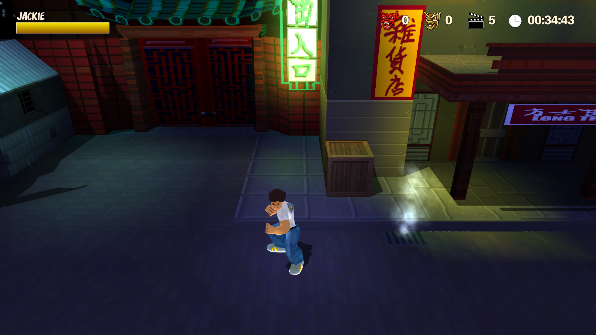
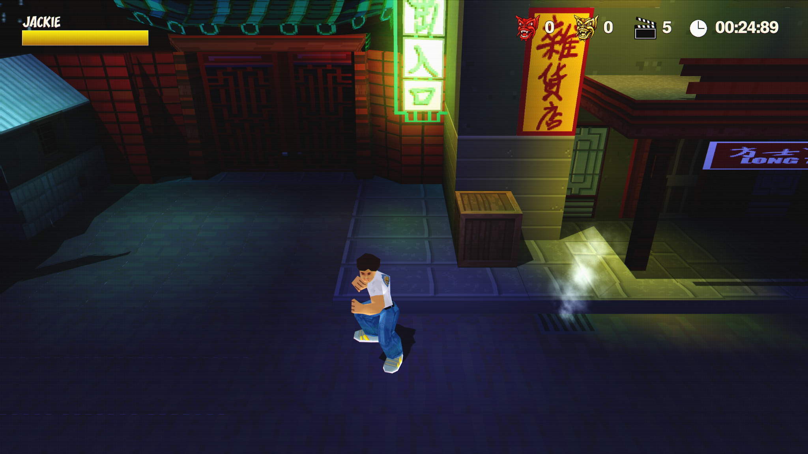
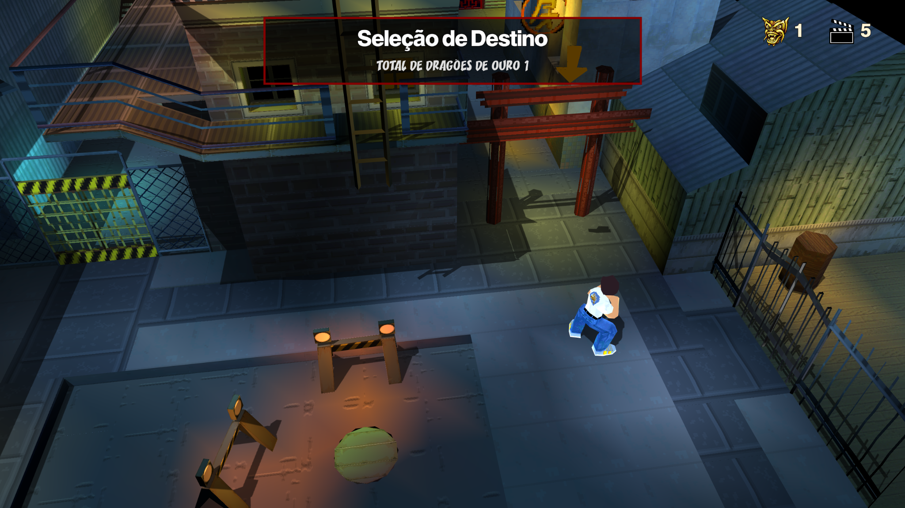
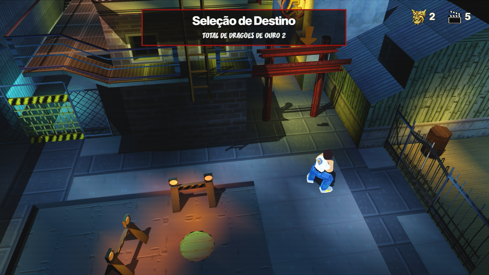

<div align="center">

# ReChan CRT 90s Consumer

### Analog CRT presentation for ReChan

[](#compatibility--compatibilidade)
[](#compatibility--compatibilidade)
[](RELEASE_NOTES_v1.1.md)
[](LICENSE)

**English · Português**

</div>

---

# 🇺🇸 English

## About

**ReChan CRT 90s Consumer** is a Windows x64 OpenGL post-processing mod for ReChan.

It preserves ReChan's normal rendering resolution and applies a CRT treatment to the final frame, tuned around the character of a good **1990s consumer CRT television**.

The goal is not to make the game artificially low-resolution. The goal is to make the final image feel like it is being displayed through a convincing CRT presentation.

## Visual profile

- Luminance-reactive CRT beam and refined scanlines
- Stable raster behavior
- Sharper luminance than chroma for a more analog consumer-video character
- Mild horizontal chroma softness and very subtle color bleed
- Subtle highlight beam / phosphor spread
- Gentle RGB phosphor-style mask
- Slightly lifted midtones while retaining dark blacks
- Vivid but controlled color response
- Very light analog noise and flicker
- No temporal ghosting
- No heavy vignette
- No fake 240p downsample
- No TV bezel or physical frame overlay
- Clean frame edges without visible border distortion

## Current release

### v1.1

**v1.1** evolves the CRT presentation toward a more authentic 1990s consumer-TV look while preserving ReChan's normal rendering resolution and the clean image character established in v1.0.

See: [Release Notes](RELEASE_NOTES_v1.1.md) · [Changelog](CHANGELOG.md)

## Download

### Latest release — v1.1

**[⬇ Download ReChan CRT 90s Consumer v1.1](https://github.com/L3X4RS/ReChan-CRT-90s-Consumer/releases/download/v1.1/ReChan_CRT_90s_Consumer_v1.1.zip)**

Previous versions and release history:

**[Open all Releases](https://github.com/L3X4RS/ReChan-CRT-90s-Consumer/releases)**

## Installation

1. Back up your current `rechan.exe`.
2. Extract the complete release package into your ReChan folder.
3. Replace files when prompted.
4. Confirm that the mod DLL exists at:

```text
ReChan\~mods\90s Consumer\crtmod.dll
```

5. Launch `rechan.exe` normally.

For more detail, see [INSTALLATION.md](INSTALLATION.md).

## Updating

If your current patched `rechan.exe` already loads:

```text
~mods\90s Consumer\crtmod.dll
```

you can normally update by replacing only the DLL.

## Removal

Restore your original `rechan.exe`, then remove:

```text
~mods\90s Consumer\
```

---

# 🇧🇷 Português

## Sobre

**ReChan CRT 90s Consumer** é um mod de pós-processamento OpenGL para a versão Windows x64 do ReChan.

Ele mantém a resolução normal de renderização do ReChan e aplica o tratamento CRT ao quadro final, buscando o caráter visual de uma boa **TV CRT doméstica dos anos 90**.

A proposta não é deixar o jogo artificialmente em baixa resolução. A ideia é fazer a imagem final parecer realmente exibida em um CRT convincente.

## Perfil visual

- Feixe CRT e scanlines reativos à luminância
- Raster estável
- Luminância mais definida que a crominância para um caráter mais próximo de vídeo analógico doméstico
- Suavização horizontal da crominância e bleed de cor muito sutis
- Pequeno espalhamento de highlights lembrando feixe / fósforo
- Máscara RGB de fósforo discreta
- Médios um pouco mais abertos sem perder os pretos
- Cores vivas, porém controladas
- Ruído analógico e flicker muito discretos
- Sem ghosting temporal
- Sem vinheta pesada
- Sem falso downsample para 240p
- Sem bezel ou moldura física de TV
- Bordas limpas, sem deformação visível no contorno

## Versão atual

### v1.1

A **v1.1** evolui a apresentação CRT para ficar mais próxima de uma TV doméstica dos anos 90, mantendo a resolução normal do ReChan e a imagem limpa estabelecida na v1.0.

Veja: [Notas da versão](RELEASE_NOTES_v1.1.md) · [Changelog](CHANGELOG.md)

## Download

### Versão mais recente — v1.1

**[⬇ Baixar ReChan CRT 90s Consumer v1.1](https://github.com/L3X4RS/ReChan-CRT-90s-Consumer/releases/download/v1.1/ReChan_CRT_90s_Consumer_v1.1.zip)**

Versões anteriores e histórico de releases:

**[Abrir todas as Releases](https://github.com/L3X4RS/ReChan-CRT-90s-Consumer/releases)**

## Instalação

1. Faça backup do seu `rechan.exe` atual.
2. Extraia o pacote completo da release dentro da pasta do ReChan.
3. Substitua os arquivos quando solicitado.
4. Confirme que o DLL do mod existe em:

```text
ReChan\~mods\90s Consumer\crtmod.dll
```

5. Abra o `rechan.exe` normalmente.

Para mais detalhes, consulte [INSTALLATION.md](INSTALLATION.md).

## Atualização

Se o seu `rechan.exe` modificado já procura por:

```text
~mods\90s Consumer\crtmod.dll
```

normalmente basta substituir apenas o DLL por uma versão mais nova.

## Remoção

Restaure o `rechan.exe` original e remova:

```text
~mods\90s Consumer\
```


---

## Before / After · Antes / Depois

### Gameplay

<table>
  <tr>
    <th width="50%">Original / Original</th>
    <th width="50%">ReChan CRT 90s Consumer v1.1</th>
  </tr>
  <tr>
    <td></td>
    <td></td>
  </tr>
</table>

### Destination Select / Seleção de destino

<table>
  <tr>
    <th width="50%">Original / Original</th>
    <th width="50%">ReChan CRT 90s Consumer v1.1</th>
  </tr>
  <tr>
    <td></td>
    <td></td>
  </tr>
</table>

<sub>Interactive slider / Comparação interativa: https://l3x4rs.github.io/ReChan-CRT-90s-Consumer/compare.html</sub>

## Compatibility / Compatibilidade

- Windows x64
- ReChan Windows build compatible with the prepared executable
- OpenGL rendering path

The mod hooks the final OpenGL `SwapBuffers` presentation and applies the CRT effect to the already-rendered frame.

O mod intercepta a apresentação final do OpenGL via `SwapBuffers` e aplica o efeito CRT sobre o quadro já renderizado.

It does **not** modify or include PlayStation game data.  
Ele **não** modifica nem inclui dados do jogo de PlayStation.

---

## Credits / Créditos

- **ReChan** — reverse-engineering / reimplementation project by its respective author(s)
- **ReChan CRT 90s Consumer** — ReChan-specific loader, OpenGL post-process port and visual tuning

See / Veja: [THIRD_PARTY_NOTICES.md](THIRD_PARTY_NOTICES.md)

---

## Legal

This is an **unofficial community modification**.  
Este é um **mod não oficial da comunidade**.

It is not affiliated with or endorsed by Sony, the rights holders of *Jackie Chan Stuntmaster*, or the ReChan project maintainers.

Não possui vínculo ou endosso da Sony, dos detentores dos direitos de *Jackie Chan Stuntmaster* ou dos mantenedores do projeto ReChan.

No PlayStation game image, ROM, disc data, original game assets, music, voices, textures, models or other copyrighted game content are included.

Nenhuma imagem de jogo de PlayStation, ROM, dados de disco, assets originais, músicas, vozes, texturas, modelos ou outro conteúdo protegido do jogo está incluído.

---

<div align="center">

**ReChan CRT 90s Consumer**  
*Built for the look of a good tube, not a fake retro overlay.*  
*Feito para ter a aparência de um bom CRT, não de um filtro retrô artificial.*

</div>
